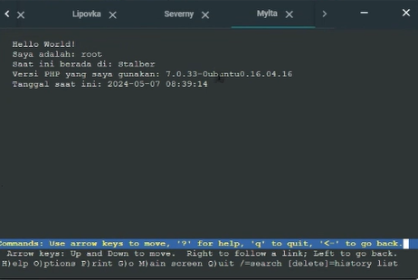

# Praktikum Modul 2 Jaringan Komputer

Praktikum Modul 2 Jaringan Komputer - **IT-03**

## Authors

| Nama                                                | NRP        |
| --------------------------------------------------- | ---------- |
| [Sighra Attariq Sumere Jati](https://www.github.com/sgraa) | 5027221068 |
| [Wilson Matthew Thendry](https://www.github.com/waifuwetdream) | 5027221024 |

### Topologi 3


# Laporan Resmi Modul 2

## Configs

- **List IP**

    ```
    (Master)
    Pochinki 10.65.1.2 

    (Slave)
    Georgopol 10.65.1.5

    (Client)
    GatkaTrenches 10.65.1.3
    GatkaRadio 10.65.1.4

    (Load Balancer)
    Mylta 10.65.2.5

    (Web Server)
    Stalber 10.65.2.2
    Severny 10.65.2.3
    Lipovka 10.65.2.4
    ```

- **Erangel Router**
    ```
    auto eth0
    iface eth0 inet dhcp
   
    auto eth1
    iface eth1 inet static
	        address 10.65.1.1
	        netmask 255.255.255.0

    auto eth2
    iface eth2 inet static
            address 10.65.2.1
            netmask 255.255.255.0
    ```

- **Pochinki DNS Master**
    ```
    auto eth0
    iface eth0 inet static
            address 10.65.1.2
            netmask 255.255.255.0
            gateway 10.65.1.1
    ```

- **Georgopol DNS Slave**
    ```
    auto eth0
    iface eth0 inet static
            address 10.65.1.5
            netmask 255.255.255.0
            gateway 10.65.1.1
    ```

- **GatkaTrenches Client**
    ```
    auto eth0
    iface eth0 inet static
            address 10.65.1.3
            netmask 255.255.255.0
            gateway 10.65.1.1
    ```

- **GatkaRadio Client**
    ```
    auto eth0
    iface eth0 inet static
            address 10.65.1.4
            netmask 255.255.255.0
            gateway 10.65.1.1   
    ```

- **Mylta LoadBalancer**
    ```
    auto eth0
    iface eth0 inet static
            address 10.65.2.5
            netmask 255.255.255.0
            gateway 10.65.2.1
    ```

- **Stalber WebServer**
    ```
    auto eth0
    iface eth0 inet static
            address 10.65.2.2
            netmask 255.255.255.0
            gateway 10.65.2.1
    ```

- **Severny WebServer**
    ```
    auto eth0
    iface eth0 inet static
            address 10.65.2.3
            netmask 255.255.255.0
            gateway 10.65.2.1
    ```

- **Lipovka WebServer**
    ```
    auto eth0
    iface eth0 inet static
            address 10.65.2.4
            netmask 255.255.255.0
            gateway 10.65.2.1
    ```

## Setup .bashrc

- **Router**
    ```
    iptables -t nat -A POSTROUTING -o eth0 -j MASQUERADE -s 10.65.0.0/16
    echo nameserver 192.168.122.1 > /etc/resolv.conf
    ```
- **DNS (Master)**
    ```
    echo nameserver 192.168.122.1 > /etc/resolv.conf

    apt-get update
    apt-get install bind9 -y
    ```

- **DNS (Slave)**
    ```
    echo 'nameserver 192.168.122.1' > /etc/resolv.conf

    apt-get update
    apt-get install bind9 -y
    ```

- **Client**
    ```
    apt-get update
    apt-get install dnsutils -y
    apt-get install lynx -y
    ```

---

## Soal 1

#### 1. Pochinki akan digunakan sebagai DNS Master,  Georgopol sebagai DNS Slave, GatkaTrenches dan GatkaRadio sebagai Client dan Mylta merupakan Load Balancer yang terdiri dari beberapa Web Server yaitu Stalber, Severny, dan Lipovka. Buatlah topologi dengan pembagian sebagai berikut. Folder topologi dapat diakses pada Google Drive yang diberikan.

### Script

**Client GatkaTrenches dan GatkaRadio**

```bash
ping google.com
```

### Hasil

#### Gatka Trenches


#### Gatka Radio


## Soal 2

#### 2. Karena para pasukan membutuhkan koordinasi untuk mengambil airdrop, maka buatlah sebuah domain yang mengarah ke Stalber dengan alamat _airdrop.xxxx.com_ dengan alias _www.airdrop.xxxx.com_ dimana xxxx merupakan kode kelompok.

### Script

#### Ubah file `/etc/bind/named.conf.local` pada Pochinki untuk membuat domain _airdrop.it03.com_. Arahkan juga script untuk menuju IP Stalber yaitu `10.65.2.2`

```bash
echo 'zone "airdrop.it03.com" {
        type master;
        file "/etc/bind/jarkom/airdrop.it03.com";
        also-notify { 10.65.1.5; }; // IP Georgopol
        allow-transfer { 10.65.1.5; }; // IP Georgopol
};
```
#### Lalu pada file `/etc/bind/jarkom/airdrop.it03.com` berikan script untuk BIND.

```bash
echo '
;
; BIND data file for local loopback interface
;
$TTL    604800
@       IN      SOA     airdrop.it03.com. root.airdrop.it03.com. (
                        2024050301      ; Serial
                         604800         ; Refresh
                          86400         ; Retry
                        2419200         ; Expire
                         604800 )       ; Negative Cache TTL
;
@       IN      NS      airdrop.it03.com.
@       IN      A       10.65.2.2     ; IP Stalber
www     IN      CNAME   airdrop.it03.com.
medkit  IN      A       10.65.2.4     ;' > /etc/bind/jarkom/airdrop.it03.com
```

```bash
ping airdrop.it03.com
ping www.airdrop.it03.com
```

### Hasil

#### Gatka Trenches


#### Gatka Radio


## Soal 3

#### 3. Para pasukan juga perlu mengetahui mana titik yang sedang di bombardir artileri, sehingga dibutuhkan domain lain yaitu _redzone.xxxx.com_ dengan alias _www.redzone.xxxx.com_ yang mengarah ke Severny. 

### Script

#### Ubah file `/etc/bind/named.conf.local` di Pochinki (DNS Master) dan tambahkan domain _redzone.it03.com_ yang mengarah ke Severny dengan IP `10.65.2.3`.

```bash
echo 'zone "redzone.it03.com" {
        type master;
        file "/etc/bind/jarkom/redzone.it03.com";
        notify yes;
        also-notify { 10.65.1.5; }; // IP Georgopol
        allow-transfer { 10.65.1.5; }; // IP Georgopol
};
```

#### Lalu pada file `/etc/bind/jarkom/redzone.it03.com` berikan script untuk BIND.

```bash
echo '
;
; BIND data file for local loopback interface
;
$TTL    604800
@       IN      SOA     redzone.it03.com. root.redzone.it03.com. (
                        2024050301      ; Serial
                         604800         ; Refresh
                          86400         ; Retry
                        2419200         ; Expire
                         604800 )       ; Negative Cache TTL
;
@       IN      NS      redzone.it03.com.
@       IN      A       10.65.2.3     ; IP Severny
www     IN      CNAME   redzone.it03.com.
ns1     IN      A       10.65.1.5     ; IP Georgopol
siren   IN      NS      ns1' > /etc/bind/jarkom/redzone.it03.com
```

```bash
ping redzone.it03.com
ping www.redzone.it03.com
```
### Hasil

#### Gatka Trenches


#### Gatka Radio


## Soal 4

#### 4. Markas pusat meminta dibuatnya domain khusus untuk menaruh informasi persenjataan dan suplai yang tersebar. Informasi persenjataan dan suplai tersebut mengarah ke Mylta dan domain yang ingin digunakan adalah _loot.xxxx_.com dengan alias _www.loot.xxxx.com_

### Script

#### Ubah file `/etc/bind/named.conf.local` pada Pochinki untuk menambahkan domain _loot.it03.com_. Arahkan juga script untuk menuju IP Mylta yaitu `10.65.2.5`

```bash
echo 'zone "loot.it03.com" {
        type master;
        file "/etc/bind/jarkom/loot.it03.com";
        notify yes;
        also-notify { 10.65.1.5; }; // IP Georgopol
        allow-transfer { 10.65.1.5; }; // IP Georgopol
};
```

#### Lalu pada file `/etc/bind/jarkom/loot.it03.com` tambahkan script untuk BIND

```bash
echo '
;
; BIND data file for local loopback interface
;
$TTL    604800
@       IN      SOA     loot.it03.com. root.loot.it03.com. (
                        2024050301      ; Serial
                         604800         ; Refresh
                          86400         ; Retry
                        2419200         ; Expire
                         604800 )       ; Negative Cache TTL
;
@       IN      NS      loot.it03.com.
@       IN      A       10.65.2.5     ; IP Mylta
www     IN      CNAME   loot.it03.com.' > /etc/bind/jarkom/loot.it03.com
```

```bash
ping loot.it03.com
ping www.loot.it03.com
```

### Hasil

#### Gatka Trenches


#### Gatka Radio


## Soal 5

#### 5. Pastikan domain-domain tersebut dapat diakses oleh seluruh komputer (client) yang berada di Erangel

### Hasil

#### Bukti bahwa komputer (client) dapat mengakses seluruh domain sudah diberikan dalam dokumentasi masing-masing nomor.

## Soal 6

#### 6. Beberapa daerah memiliki keterbatasan yang menyebabkan hanya dapat mengakses domain secara langsung melalui alamat IP domain tersebut. Karena daerah tersebut tidak diketahui secara spesifik, pastikan semua komputer (client) dapat mengakses domain _redzone.xxxx.com_ melalui alamat IP Severny (Notes : menggunakan pointer record)

### Script

#### Ubah file `/etc/bind/named.conf.local` pada Pochinki untuk menambahkan konfigurasi pada _redzone.it03.com_. Penambahan konfigurasi `PTR` akan membantu dalam soal ini.


```bash
echo 'zone "2.65.10.in-addr.arpa" {
        type master;
        file "/etc/bind/jarkom/2.65.10.in-addr.arpa";
};' > /etc/bind/named.conf.local
```

#### Lalu pada file `/etc/bind/jarkom/2.65.10.in-addr.arpa` tambahkan script untuk BIND, `2.65.10` sendiri merupakan hasil dari 3 angka pertama IP Address utama yang telah dibalik.

```bash
echo '
;
; BIND data file for local loopback interface
;
$TTL    604800
@       IN      SOA     redzone.it03.com. root.redzone.it03.com. (
                        2024050301      ; Serial
                         604800         ; Refresh
                          86400         ; Retry
                        2419200         ; Expire
                         604800 )       ; Negative Cache TTL
;
2.65.10.in-addr.arpa.   IN      NS      redzone.it03.com.
3                       IN      PTR     redzone.it03.com.' > /etc/bind/jarkom/2.65.10.in-addr.arpa
```

### Hasil
#### Pengecekan Host Pointer Record


## Soal 7

#### 7. Akhir-akhir ini seringkali terjadi serangan siber ke DNS Server Utama, sebagai tindakan antisipasi kamu diperintahkan untuk membuat DNS Slave di Georgopol untuk semua domain yang sudah dibuat sebelumnya.

### Script

#### Untuk mengarahkan domain ke DNS Slave yang terdapat di Georgopol maka diperlukan setup tambahan agar mengarah ke IP Georgopol `10.65.1.5` pada `/etc/bind/named.conf.local` dalam setiap zone domainnya di DNS Master Pochinki seperti berikut:

```bash
    also-notify { 10.65.1.5; }; // IP Georgopol
    allow-transfer { 10.65.1.5; }; // IP Georgopol
```
#### Lalu di node Georgopol, dapat ditambahkan konfigurasi pada `/etc/bind/named.conf.local` untuk mengarahkan domain saat node Master Pochinki dimatikan. Berikut snippet codenya.

```bash
echo 'zone "airdrop.it03.com" {
    type slave;
    masters { 10.65.1.2; }; //IP Pochinki
    file "/var/lib/bind/airdrop.it03.com";
};

zone "redzone.it03.com" {
    type slave;
    masters { 10.65.2.3; };
    file "/var/lib/bind/redzone.it03.com";
};

zone "loot.it03.com" {
    type slave;
    masters { 10.65.1.2; };
    file "/var/lib/bind/loot.it03.com";
};
zone "siren.redzone.it03.com" {
        type master;
        file "/etc/bind/siren/siren.redzone.it03.com";
};'  > /etc/bind/named.conf.local
```

### Hasil

#### DNS Master Pochinki Dimatikan


#### Gatka Trenches Tetap Berjalan


#### Gatka Radio Tetap Berjalan


## Soal 8

#### 8. Kamu juga diperintahkan untuk membuat subdomain khusus melacak airdrop berisi peralatan medis dengan subdomain _medkit.airdrop.xxxx.com_ yang mengarah ke Lipovka.

### Script

#### Untuk menambahkan subdomain untuk melacak airdrop berisi peralatan medis, dapat kita lakukan dengan menambahkan ke DNS Master Pochinki di bagian `/etc/bind/jarkom/airdrop.it03.com` sebagai berikut:

```bash
medkit  IN      A       10.65.2.4     ;' > /etc/bind/jarkom/airdrop.it03.com
```

#### Dari kode diatas akan menambahkan subdomain terhadap `airdrop.it03.com` yaitu `medkit.airdrop.it03.com`

```bash
echo '
;
; BIND data file for local loopback interface
;
$TTL    604800
@       IN      SOA     airdrop.it03.com. root.airdrop.it03.com. (
                        2024050301      ; Serial
                         604800         ; Refresh
                          86400         ; Retry
                        2419200         ; Expire
                         604800 )       ; Negative Cache TTL
;
@       IN      NS      airdrop.it03.com.
@       IN      A       10.65.2.2     ; IP Stalber
www     IN      CNAME   airdrop.it03.com.
medkit  IN      A       10.65.2.4     ;' > /etc/bind/jarkom/airdrop.it03.com
```

### Hasil

#### Gatka Trenches


#### Gatka Radio


## Soal 9

#### 9. Terkadang red zone yang pada umumnya di bombardir artileri akan dijatuhi bom oleh pesawat tempur. Untuk melindungi warga, kita diperlukan untuk membuat sistem peringatan air raid dan memasukkannya ke subdomain _siren.redzone.xxxx.com_ dalam folder siren dan pastikan dapat diakses secara mudah dengan menambahkan alias _www.siren.redzone.xxxx.com_ dan mendelegasikan subdomain tersebut ke Georgopol dengan alamat IP menuju radar di Severny.

### Script

#### Dalam soal ini kita diminta untuk menambahkan subdomain _siren.redzone.it03.com_ dengan alias _www.siren.redzone.it03.com_ dan didelegasikan ke Georgopol menggunakan IP Severny yaitu `10.65.2.3`. Kita dapat menambahkan snippet kode ini pada `/etc/bind/jarkom/redzone.it03.com` untuk mengarahkan ke IP Georgopol.

```bash
ns1     IN      A       10.65.1.5     ; IP Georgopol
siren   IN      NS      ns1' > /etc/bind/jarkom/redzone.it03.com
```

#### Kita juga harus menambahkan setup domain untuk siren dan alias www-nya di DNS Slave Georgopol, kita juga harus menambahkan delegasinya dengan menambahkan IP Severny `10.65.2.3` pada `etc/bind/named.conf.local` tambahkan kode ini untuk menambah zone siren dan juga membuat delegasi ke Severny.

```bash
echo 'zone "siren.redzone.it03.com" {
        type master;
        file "/etc/bind/siren/siren.redzone.it03.com";
};'  > /etc/bind/named.conf.local
```

```bash
echo '
;
; BIND data file for local loopback interface
;
$TTL    604800
@       IN      SOA     siren.redzone.it03.com. root.siren.redzone.it03.com. (
                        2024050401      ; Serial
                         604800         ; Refresh
                          86400         ; Retry
                        2419200         ; Expire
                         604800 )       ; Negative Cache TTL
;
@       IN      NS      siren.redzone.it03.com.
@       IN      A       10.65.2.3       ; IP Severny
www     IN      CNAME   siren.redzone.it03.com.
log     IN      A       10.65.2.3       ;' > /etc/bind/siren/siren.redzone.it03.com
```

#### Setelah menambahkan arahan tersebut, kita juga harus menambahkan kode dibawah ini pada node Pochinki dan Georgopol di `etc/bind/named.conf.options`, yaitu:

```bash
allow-query { any; };
```

### Hasil

#### Gatka Trenches


#### Gatka Radio


## Soal 10

#### 10. Markas juga meminta catatan kapan saja pesawat tempur tersebut menjatuhkan bom, maka buatlah subdomain baru di subdomain siren yaitu _log.siren.redzone.xxxx.com_ serta aliasnya _www.log.siren.redzone.xxxx.com_ yang juga mengarah ke Severny.

### Script

#### Untuk menambahkan subdomain baru pada siren, kita dapat melakukan hal yang sama dengan soal 8. Berikut potongan kode yang dapat ditambahkan untuk memberi `log` pada _siren.redzone.it03.com_

```bash
log     IN      A       10.65.2.3
www.log IN      CNAME   www.siren.redzone.it03.com.'> /etc/bind/siren/siren.redzone.it03.com
```
### Hasil

#### Gatka Trenches


#### Gatka Radio


## Soal 11

#### 11. Setelah pertempuran mereda, warga Erangel dapat kembali mengakses jaringan luar, tetapi hanya warga Pochinki saja yang dapat mengakses jaringan luar secara langsung. Buatlah konfigurasi agar warga Erangel yang berada diluar Pochinki dapat mengakses jaringan luar melalui DNS Server Pochinki

### Script

#### Untuk soal 11 kita dapat memberikan akses jaringan luar melalui DNS Server Pochinki dengan menambahkan `forwarders`

```bash
forwarders {
    192.168.122.1;
};
```

### Hasil

#### Forwarder


### Soal 12

Diminta untuk deploy website dengan menggunnakan `apache` pada **Serverny**
```sh
echo '<VirtualHost  *:8080>

	ServerAdmin webmaster@localhost
	DocumentRoot /var/www/web-8080

	ErrorLog ${APACHE_LOG_DIR}/error.log
	CustomLog ${APACHE_LOG_DIR}/access.log combined

</VirtualHost>' > /etc/apache2/sites-available/default-8080.conf

echo 'Listen 8080' >> /etc/apache2/ports.conf
```
Dibuat config file untuk deploy server menggunakan port 8080 dengan folder `/var/www/web-8080` sebagai root.
```sh
echo "<?php
$hostname = gethostname();
$date = date('Y-m-d H:i:s');
$php_version = phpversion();
$username = get_current_user();


echo "Hello World!<br>";
echo "Saya adalah: $username<br>";
echo "Saat ini berada di: $hostname<br>";
echo "Versi PHP yang saya gunakan: $php_version<br>";
echo "Tanggal saat ini: $date<br>";
?>" > /var/www/web-8080/index.php
```
Lalu masukkan resource website yang sudah disediakan ke dalam folder root website.


Gunakan `lynx 10.65.2.3:8080` (ip address **Serverny** = 10.65.2.3) untuk membuka website yang dihosting pada **Serverny**.

### Soal 13

Diminta untuk membuat load balancer pada web sebelumnya, dengan **Serverny**, **Stalber**, dan **Lipovka** sebagai worker dan **Mylta** sebagai load balancer.

- Set up worker

    Untuk worker tambahan yaitu **Stalber** dan **Lipovka** bisa dilakukan konfigurasi yang sama dengan **Serverny** pada [Soal 12](#soal-12).

- Set up load balacer

    ```sh
    #address
    serverny="10.65.2.3"
    stalber="10.65.2.2"
    lipovka="10.65.2.4"

    #config file
    echo "<VirtualHost *:8080>
        ServerAdmin webmaster@localhost
        DocumentRoot /var/www/web-8080

        ProxyRequests Off
        <Proxy balancer://mycluster>
            BalancerMember http://${serverny}:8080
            BalancerMember http://${stalber}:8080
            BalancerMember http://${lipovka}:8080
            ProxySet lbmethod=byrequests
        </Proxy>

        ProxyPass / balancer://mycluster/
        ProxyPassReverse / balancer://mycluster/
    </VirtualHost>" > /etc/apache2/sites-available/default-8080.conf

    echo 'Listen 8080' >> /etc/apache2/ports.conf
    ```
    Dibuat konfigurasi balancer yang mengarah ke 3 worker yang sudah dibuat pada port 8080, sehingga ketika mengakses web melalui load balancer akan diarahkan ke 3 worker tersebut secara bergantian.

Gunakan `lynx 10.65.2.5:8080` (ip address **Mylta** = 10.65.2.5) untuk mengakses website melalui load balancer. 





Dari output tersebut dapat dilihat bahwa load balancer membagi load pada setiap worker secara bergantian setiap ada request masuk.

### Soal 14

Diminta untuk mengubah semua worker dan load balancer yang sudah dibuat dari menggunakan **apache** menjadi **nginx**.

- Set up worker
    
    ```sh
    echo 'server {
            listen 6969;

            root /var/www/web-8080;
            index index.php index.html index.htm index.nginx-debian.html;

            server_name _;

            location / {
                    try_files $uri $uri/ /index.php?$query_string;
            }

            location ~ \.php$ {
                    include snippets/fastcgi-php.conf;
                    fastcgi_pass unix:/run/php/php7.0-fpm.sock;
            }

            location ~ /\.ht {
                    deny all;
            }
    }' > /etc/nginx/sites-available/web-8080

    ln -s /etc/nginx/sites-available/web-8080 /etc/nginx/sites-enabled/web-8080
    ```
    Dibuat konfigurasi untuk semua worker (bisa menggunakan script yang sama) pada port 6969 dengan tetap menggunakan folder root website yang sama seperti sebelumnya yaitu `/var/www/web-8080`.

- Set up load balancer

    ```sh
    #address
    serverny="10.65.2.3"
    stalber="10.65.2.2"
    lipovka="10.65.2.4"

    echo "upstream backend {
    server ${serverny}:6969;
    server ${stalber}:6969;
    server ${lipovka}:6969;
    }

    server {
    listen 69;
    server_name mylta.it03.com www.mylta.it03.com;

    location / {
        proxy_pass http://backend;
    }
    }
    " > /etc/nginx/sites-available/web-8080

    ln -s /etc/nginx/sites-available/web-8080 /etc/nginx/sites-enabled
    ```
    Dibuat konfigurasi balancer yang sama seperti sebelumnya dan mengarah ke 3 worker yang sudah dibuat pada port 69.

Gunakan `lynx 10.65.2.5:69` (ip address **Mylta** = 10.65.2.5) untuk mengakses ketiga worker melalui load balancer. 


Dari output tersebut dapat dilihat bahwa load balancer membagi load pada setiap worker secara bergantian setiap ada request masuk.